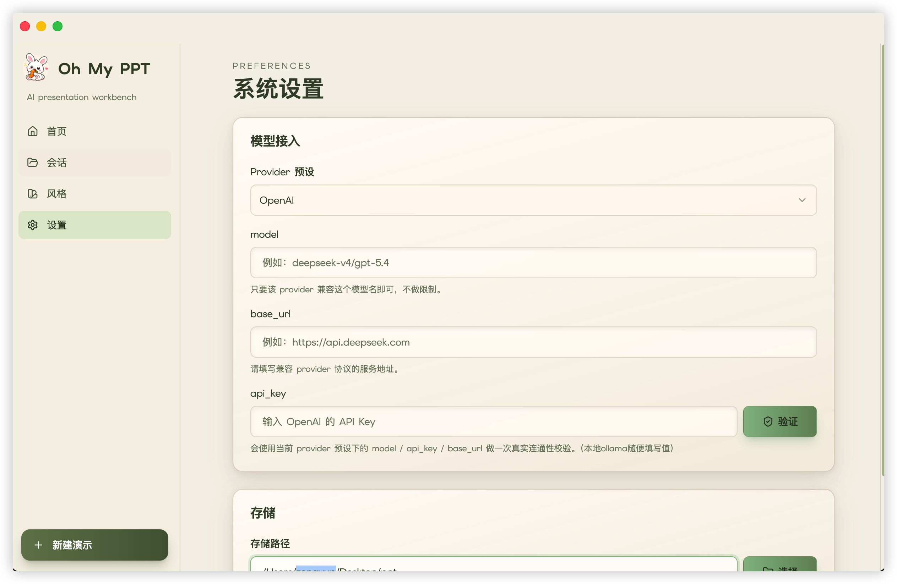
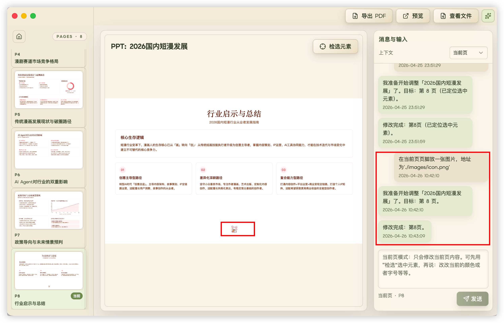
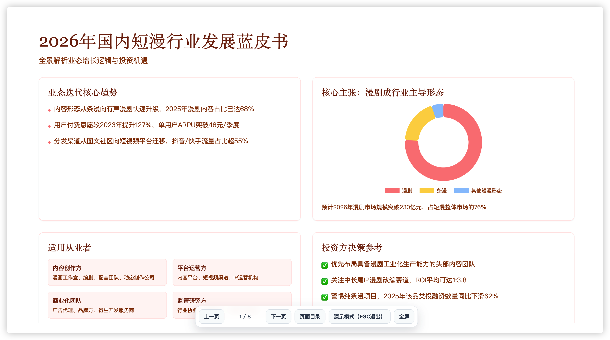

<div align="center">
  
  <br/>
  <br/>


**Oh My PPT - 纯本地 AI 幻灯片生成与编辑工具**

[English](./README_EN.md) | [为什么做这个](#why) • [能做什么](#features) • [使用流程](#workflow) • [使用问题](#usage-notes)

  <p>
    Local-first AI Slide Deck Generator<br/>
    Runs locally · AI-powered creation<br/>
    Prompt in → Deck out 👇
  </p>

  

  [观看完整演示视频](https://raw.githubusercontent.com/arcsin1/oh-my-ppt/main/docs/video/ohmyppt.mp4)
</div>

---

<a id="why"></a>
## 🎯 为什么做这个

每次要做分享/汇报/路演/答辩就头疼，纠结PPT排版占了大半时间

市面上AI PPT工具虽然多，但大多生成的是固定格式文件，想微调样式或加入自己想要的动画演示都很麻烦

所以自己写了一个Html版的PPT生成器——初衷是给自己做个工具使用（其实发现写简历模版也可以用）

生成的是HTML版PPT：打开即预览、无需软件、一个浏览器搞定，还能随心改样式/加动效/插代码/生成pdf分享

<a id="features"></a>
## ✅ 能做什么

💬 **一句话生成** — 输入主题和需求，AI 自动规划大纲 + 配色 + 排版，直接出完整 PPT
🔒 **本地优先** — 全部跑在自己电脑上，不用注册、不用担心数据泄露
🎨 **内置 30+ 风格SKILL** — 极简白、赛博霓虹、包豪斯、日式简约、小红书白… 也支持自定义风格
✏️ **对话式修改** — 对着某一页说"标题换个颜色""加个数据图表"，精准修改不用重做
🎬 **页面切换动画** — 预览时页面切换自带过渡动画，演示效果拉满
📄 **导出 PDF** — 一键导出，自动打开文件夹定位，分享超方便

<a id="workflow"></a>
## 🔄 使用流程

> 💡 输入你的需求 → AI 会规划大纲 → 生成视觉风格 → 逐页渲染 → 预览 & 对话修改 → 导出


<a id="ollama"></a>
## 🦙 支持本地 Ollama 模型（OpenAI 兼容）

项目支持通过 **OpenAI 兼容协议** 接入本地 Ollama。

在「设置」页面这样填写即可：

- `provider`: `openai`
- `base_url`: `http://127.0.0.1:11434/v1`
- `model`: 你本地拉取的模型名（例如 `qwen2.5-coder:14b`），建议支持 14B+（或云端强模型）
- `api_key`: 任意非空字符串（例如 `ollama`）

说明：

- Ollama 默认不校验 API Key，但应用侧会做“非空”校验，所以不能留空。
- 推荐使用 14B+（或云端强模型）做接入生成。


<a id="usage-notes"></a>
## 关于使用问题汇总

### 别忘了填写你的配置

  在「设置」页面填写你的配置，否则会报错。 

  


### 如何添加图片到 PPT 中
   
   在你的本地文件目录，我会提前放好images/目录，你可以在目录下放图片文件，例如：'./images/1.png'

  

### 关于预览模式
   
   支持键盘（左右键）切换，支持演示模式，全屏演示模式，ESC退出演示模式
  
  

## 📦 未签名应用打开问题

### macOS

如果 macOS 提示应用无法打开，可以执行：

```bash
xattr -cr /Applications/OhMyPPT.app
```

然后重新打开应用。也可以右键应用选择“打开”来绕过首次提示。

### Windows

未签名安装包在 Windows 上可能触发 SmartScreen 提示，这是正常现象。

解决方式：点击“更多信息” → “仍要运行”即可。

## 🙌 需求反馈

如果你有新需求、功能建议或发现问题，欢迎在仓库提交 Issue。

我会持续跟进并优化体验。


## 参考

- [ui-ux-pro-max-skill](https://github.com/nextlevelbuilder/ui-ux-pro-max-skill)
- [html-ppt-skill](https://github.com/lewislulu/html-ppt-skill)

## License

This project is licensed under the [MIT License](LICENSE) © 2026 arcsin1 &lt;zy19931129@gmail.com&gt;.
