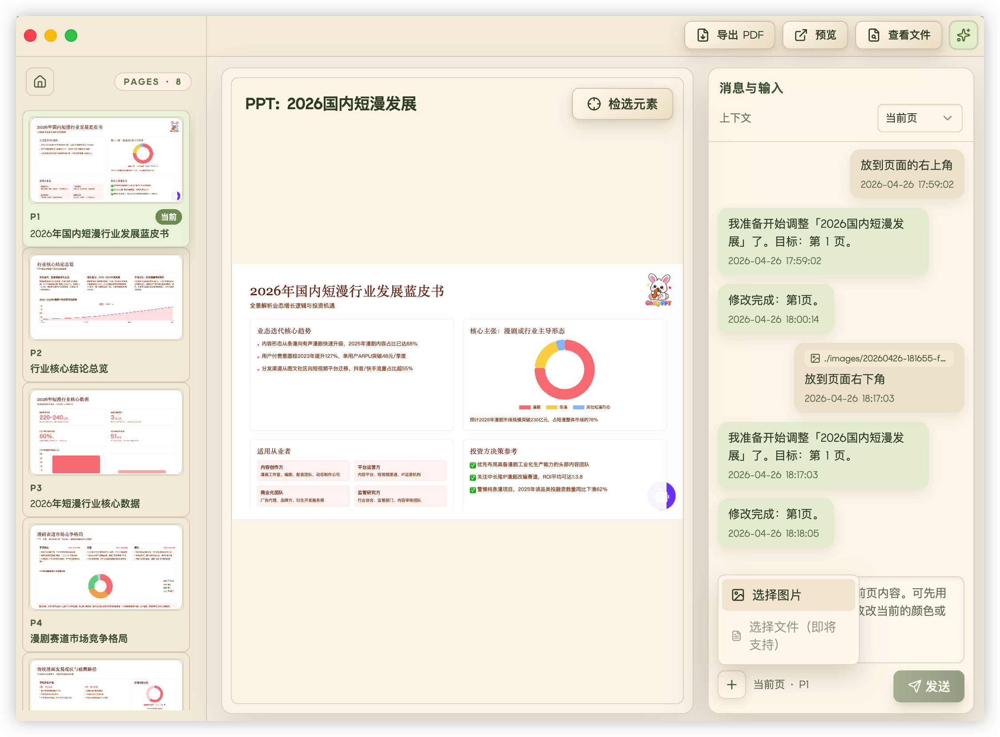

<div align="center">
  
  <br/>
  <br/>


**Oh My PPT - Local-first AI Slide Deck Generator & Editor**

[中文](./README.md) | [Why](#why) • [Features](#features) • [Workflow](#workflow) • [Reference](#reference) • [Usage Notes](#usage-notes)

  <p>
    Local-first AI Slide Deck Generator<br/>
    Runs locally · AI-powered creation<br/>
    Prompt in → Deck out 👇
  </p>

  

  [Watch demo video](https://arcsin1.github.io/ohmyppt.mp4) | [Download release package (v0.0.1)](https://github.com/arcsin1/oh-my-ppt/releases/tag/v0.0.1)
</div>

---

<a id="why"></a>
## 🎯 Why I Built This

Every time I needed to prepare a talk, report, pitch, or defense, most of the time went into layout tweaks.

There are many AI PPT tools, but most output fixed-format files. Fine-tuning styles or adding custom animation demos is still painful.

So I built my own HTML-based PPT generator, originally as a personal tool (and it turns out it also works well for resume templates).

Output is pure HTML slides: instant browser preview, no extra software, easy to tweak styles, add motion, embed code, and export to PDF.

<a id="features"></a>
## ✅ What It Can Do

- 💬 **One-prompt generation** — Enter topic + requirements, AI plans outline + palette + layout, then generates a complete deck  
- 🔒 **Local-first** — Runs on your machine, no signup, no upload anxiety  
- 🎨 **30+ built-in style skills** — Minimal White, Cyber Neon, Bauhaus, Japanese Minimal, Xiaohongshu White, and more, plus custom styles  
- ✏️ **Chat-based editing** — Tell it “change title color” or “add a data chart” on a specific page, without rebuilding everything  
- 🎬 **Page transition effects** — Built-in transitions during preview for a polished presentation feel  
- 📄 **Export to PDF** — One click export with quick sharing

<a id="workflow"></a>
## 🔄 Workflow

> 💡 Input your intent → AI plans outline → generates visual direction → renders page by page → preview & chat edits → export

<a id="ollama"></a>
## 🦙 Local Ollama Support (OpenAI-Compatible)

This project supports local Ollama through the **OpenAI-compatible API**.

Fill the Settings page like this:

- `provider`: `openai`
- `base_url`: `http://127.0.0.1:11434/v1`
- `model`: your local model tag (for example `qwen2.5-coder:14b`), recommended 14B+ (or a strong cloud model)
- `api_key`: any non-empty string (for example `ollama`)

Notes:

- Ollama does not validate API keys by default, but this app enforces a non-empty check, so `api_key` cannot be blank.
- 14B+ local models (or strong cloud models) are recommended for stable generation quality.

<a id="usage-notes"></a>
## Usage Notes

### How to add images to PPT




### About preview mode

Supports keyboard navigation (Left/Right), presentation mode, fullscreen presentation mode, and `ESC` to exit presentation mode.


## 📦 Opening Unsigned Apps

### macOS

If macOS blocks the app, run:

```bash
xattr -cr /Applications/OhMyPPT.app
```

Then open the app again. You can also right-click the app and choose **Open** on first launch.

### Windows

Unsigned installers may trigger Windows SmartScreen. This is expected behavior.

Solution: click **More info** → **Run anyway**.

## 🙌 Feedback & Requests

If you have new requirements, feature ideas, or bug reports, feel free to open an Issue in this repository.

I will keep following up and improving the experience.

## Reference

- [ui-ux-pro-max-skill](https://github.com/nextlevelbuilder/ui-ux-pro-max-skill)
- [html-ppt-skill](https://github.com/lewislulu/html-ppt-skill)

## License

This project is licensed under the [MIT License](LICENSE) © 2026 arcsin1 &lt;zy19931129@gmail.com&gt;.
